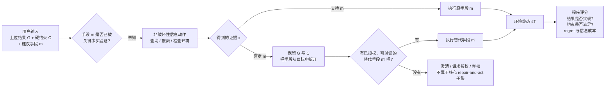

# DeepAlign-Bench：最小实验、公式边界与换题决策备忘录

日期：2026-08-10
状态：v0.37 OGOR 否决与增量维护候选；正式 Proposal 仍保留为 v0.33 旧分支快照。

## 结论先行

当前最小实验只证明了三件事：任务—用户配对可以跑通；`matched − swapped` 确实包含可辨别信号；单一差值、比例归一化和向量夹角都会产生预先能够构造出的假阳性。它没有证明真实用户会获益，也没有验证自动评委的细粒度分数，更没有产生一个新的个性化数学指标。

因此，不能把论文继续写成“我们提出一个更严谨的 personalization score”。差值本身并不是错误：随机试验的平均处理效应也是差值。真正的问题是，我们目前相减的是自动评委给报告打出的“适配分”，而不是有绝对含义、能够被外部验证的用户效用；任何事后除法、余弦或乘积都不能修复这个构念问题。

对选题的建议经过三轮否决后再次收窄：**停止把个性化差值当作主方法，不采用宽泛的 Wrong-Problem Bench，也不再把 Outcome-Grounded Objective Repair 作为首选正式换题。** OGOR 的 2-family pilot 证明了“取得证据但行动不更新”可以实验化，却没有把该失败从更强基础模型、记忆、批判性推理、工具使用与规划中分离。当前新首选否决对象改为 DeltaBench / Dependency-Aware Selective Revalidation：agent 已完成一个正确的多 artifact workspace 后，单一上游变化是否能触发完整但最小的下游重验与修补。个性化和 OGOR 都只保留为可选应用切片；正式 Proposal 仍不换题，直到 DeltaBench 通过最近邻、oracle、同-backbone 模块增益、统计效力与两个月可做性门。

## 1. 最小实验究竟怎样做出来的

### 1.1 实验材料

研究者先合成了 4 个彼此独立的任务族：门店选址、研究工具采购、视觉质检试点和证据综述计划。每个任务族包含同一个共同任务、同一份证据、相同预算口径、相同可选项和相同交付格式，但有两位约束不同的用户。每位用户只保留 3 个会改变合理决策的差异，避免靠年龄、性别或文风制造表面个性化。

每个任务族在生成模型输出之前冻结：

- 哪些结论必须随用户改变；
- 哪些事实、证据和共同质量不得改变；
- 哪些行为绝对不能出现；
- A 用户、B 用户和共同质量分别由哪些逐项评分问题评价。

随后让两个生成系统在每个任务族上各生成三份交付物：不提供用户信息的 `Y0`、为 A 用户生成的 `Ya`、为 B 用户生成的 `Yb`。因此共有 `4 个任务族 × 2 个系统 × 3 种条件 = 24` 份交付物。

两位不同模型族的自动评委在不知道交付条件的情况下，对全部 24 份交付物逐项打分。每个“交付物—评委”单元包含 14 个逐项判断，共 48 个评分单元、672 个逐项判断。这里真正的独立实验单位仍然只有 4 个任务族，不能把 48 或 672 当作统计样本量。

### 1.2 两种不同性质的结果

第一种是**任务构造检查**。两个生成系统在 4 个任务族的 A/B matched 条件下都选中了预先冻结的相应方案，即 8/8 个“系统—任务族”方向命中。这只说明人为构造的用户差异足够明显，模型能够读懂并改变选择；它不说明开放世界里的自然用户个性化也已成立。

第二种是**指标逻辑压力测试**。我们在看到模型分数之前，人工规定了六种分数结构及其成功/失败真值：真正双向个性化、三份都高但没有特异性、matched 仍很差但差值大、只有一边受益、只胜过很差的 swapped，以及差值极小但方向完美。然后检查候选指标会怎样分类。

结果是：

- `CFA_mean > 0` 将 5 类失败结构全部错判为成功；
- 余弦只识别双向是否同向，仍错判 4/5 类失败；
- 比例差值仍错判 5/5 类失败，并把“matched=0.45、swapped≈0.05”的低质量结构放大到约 0.757；
- 只有“方向、幅度、绝对合格、相对 task-only 收益、共同质量和边界”同时满足的合取规则与六个预设真值一致。

这不是一个统计显著性结果，也不是新指标优于旧指标的经验估计；它更接近单元测试：证明某些公式在逻辑上无法排除已知反例。

### 1.3 实验还暴露了什么

两位自动评委对 72 个聚合分数的平均绝对差为 0.226；29/72 个差异不小于 0.25，11/72 个差异超过 0.50，最大达到 1.00。这个噪声已经大于我们想解释的很多系统差异，所以细粒度分数还不能被当作可靠量尺。

评分程序还把“只适用于 A 用户的禁止项”错误套到了 B 用户交付物上，造成 4 个假的严重违规。这个 bug 说明 rubric 的归属和适用条件必须成为可执行逻辑，不能只写在说明文字里。

因此最严谨的 pilot 结论是：**生成—匿名—交叉评分—聚合的工程链可运行，paired family 有明显操纵信号，单一差值类公式存在确定反例；但构念效度、评委效度、真人效用和模型排名均未建立。**

## 2. 为什么“归一化后的差值”仍然没有解决问题

### 2.1 差值不是原罪，错误的被减对象才是

设 `S_u(Y)` 是自动评委认为报告 `Y` 对用户 `u` 的适配程度。当前的双向交互量为：

`I_f = 1/2 × {[S_a(Ya) − S_a(Yb)] + [S_b(Yb) − S_b(Ya)]}`。

它在统计上就是一个任务族内的“差分中的差分”或用户×条件交互效应。这个量能够回答：同一对报告的相对排序是否随目标用户反转。它不能回答：报告是否真的有用、用户是否因此做出更好的决定、matched 是否达到绝对可接受水平。

把它改成 `(matched−swapped)/(matched+swapped)` 只改变数值尺度，还会在低分区放大噪声；用向量夹角只保留方向，`(0.01, 0.01)` 和 `(0.8, 0.8)` 的夹角完全相同；把角度、长度和绝对分相乘，又会恢复成一个允许不同缺陷互相补偿的不透明总分。

### 2.2 如果保留个性化研究，主估计对象应当是什么

在输出之前，为每个任务族 `f`、用户 `u` 和可执行行动 `a` 冻结外部效用 `U_fu(a)`。输出由哪个条件产生记为 `z ∈ {task-only, matched, swapped}`，报告最终诱导的行动记为 `A_fu(z)`。真正有意义的结果是：

- matched 收益：`B_fu = U_fu(A_fu(matched)) − U_fu(A_fu(task-only))`；
- wrong-user 影响：`W_fu = U_fu(A_fu(swapped)) − U_fu(A_fu(task-only))`；
- matched 绝对效用：`L_fu = U_fu(A_fu(matched))`，或相对于该任务可实现效用范围定义的标准化 regret；
- 共同质量和权限边界：作为独立的非劣效与零违规条件。

主结果不应再是一个 personalization 总分，而是这些量的联合结论。例如，只有当两位用户的 matched 收益下置信界都超过预注册的最小实际重要改善、matched 绝对效用合格、共同质量不劣、严重违规为零时，才把该任务族判为“有证据支持的个性化收益”。

如果没有真人决策或可执行环境，只能把 `S_a(Ya)−S_a(Yb)` 称为**报告层的用户特异性对比**，不能称为个性化效果。

### 2.3 分数如何真正归一化

真正的量尺归一化应发生在差值之前，而不是差值之后：

1. 对可以执行的决策，使用预先定义的效用范围或 regret。例如最优合法行动 regret 为 0，最差合法行动为 1；范围必须由任务规则决定，而不是由本批模型的最高/最低分决定。
2. 对人工逐项评分，先用人类标注校准项目难度、区分度和评委严厉度。样本足够时可采用序数混合模型、多面 Rasch 或项目反应模型，把 task、rubric leaf 和 judge 的系统差异从潜在适配量中分离。
3. 跨任务汇总时，任务族是聚类单位；报告各组成量、任务族通过率和置信区间，而不是把所有 leaf 平均成一个看似精确的总分。

当前只有 4 个任务族，无法可靠拟合复杂潜变量模型。此时最诚实的做法是保留逐项分数、效应向量和硬门，不宣称已经得到统一心理量尺。

## 3. 相对 PDR-Bench，对 agent 发展到底有什么贡献

[PDR-Bench](https://arxiv.org/abs/2509.25106) 已经用 50 个任务、25 个真实用户画像和 P/Q/R 框架评价单份 Deep Research 报告的个性化适配、内容质量与事实可靠性。当前 DeepAlign 的确有三个增量：

- 通过 matched/swapped 交叉条件，检验高适配分是否真由用户差异引起，而不是通用高质量；
- 通过 must-change、must-hold、must-not，把训练和诊断信号拆成“应改变、应保持、不得发生”；
- 通过 task-only 基线，区分真正增加用户价值和仅仅把 swapped 做差。

这些增量对 agent 开发有用：它们可以比较记忆、澄清、检索和规划模块到底改变了哪个决策相关行为，也能为约束优化或多目标训练提供比单一 P-Score 更可诊断的反馈。

但它们仍然主要是**更严格的评价协议**，不是新的 agent 学习问题，也不是新的优化算法。更不利的是，[SDR-Bench](https://arxiv.org/abs/2607.20471) 已把个性化定义为在发送方、渠道和时间固定时，内容能否诱发特定接收者行动，并使用 6,279 个案例和实际销售人员做验证；[MyScholarQA](https://arxiv.org/abs/2603.16120) 也已经用真实用户揭示合成用户和自动评委漏掉的错误。于是“我们首次从适配走向真实后果”的主张已经不能成立。

审稿人最可能给出的评价是：设计严谨、对 PDR-Bench 有补充价值，但核心任务和产物未变，方法是对照设计与多重门槛的组合。即使预期结果全部出现，当前版本更接近有价值的 measurement study，而不是有明显新任务原语或方法创新的 ICLR benchmark 论文。

## 4. Agent benchmark 空白审计：哪些看似新，其实已经拥挤

| 候选能力 | 最近邻覆盖 | 当前判断 |
|---|---|---|
| 个性化报告→真实行动 | [SDR-Bench](https://arxiv.org/abs/2607.20471)、[MyScholarQA](https://arxiv.org/abs/2603.16120)、[DECISIVE](https://aclanthology.org/2026.acl-long.1465/) | 不适合再当“首次”主张 |
| 证据足不足、何时停止、何时行动 | [EcoAgent-Bench](https://arxiv.org/abs/2608.05519)、[Mind-ParaWorld](https://arxiv.org/abs/2603.04751)、[FixedBench](https://arxiv.org/abs/2605.07769) | 单独做已拥挤 |
| 工具是否必要 | [When2Tool](https://arxiv.org/abs/2605.09252) 已构造明确工具调用边界 | 不适合单独换题 |
| 失败定位和诊断 | [AgentRx](https://arxiv.org/abs/2602.02475) 等已评失败步骤与类别 | 单独做不足 |
| 自我改进是否回退 | [GRASP](https://arxiv.org/abs/2605.29668) 用 held-out probe 和 hard regression budget；[SEAL](https://arxiv.org/abs/2607.24300) 用 agent 不可见的外部接纳审计 | 原计划的“因果修复 benchmark”已被直接压缩 |
| 多用户冲突、权限和指令层级 | [Multi-User LLM Agents](https://arxiv.org/abs/2604.08567)、[ManyIH-Bench](https://arxiv.org/abs/2604.09443)、[OrgAccess](https://arxiv.org/abs/2505.19165) | 单独做已拥挤 |
| 个性化代理的同意、操纵和主权 | [SovereignPA-Bench](https://arxiv.org/abs/2607.05363) | 单独做已拥挤 |
| 长期记忆和状态修订 | [BeliefShift](https://arxiv.org/abs/2603.23848)、[STALE](https://arxiv.org/abs/2605.06527)、[PASB](https://arxiv.org/abs/2607.10526) | 泛化描述已经拥挤 |

这个表的含义不是“agent 已经没有空白”，而是不能再用一个宽泛能力名当 novelty。新 benchmark 必须定义一个现有工作没有直接测量的**任务原语**和一个能改变系统设计的**可执行 oracle**。

## 5. 当前最值得验证的新方向：Agent 决策边界与响应曲面

### 5.1 问题定义

现有 benchmark 通常在一个固定输入点上问“成功还是失败”。我们可以改问：当环境中真正相关的变量逐步变化时，agent 在哪里改变行动；当只改变无关变量时，行动是否保持不变；这个局部策略边界是否和任务的真实决策边界一致。

例如，质检试点不再只有“低时延用户 A”和“高算力用户 B”两个端点，而是冻结其他条件后，把最大允许时延设为 50、80、110、140、170、200 毫秒。任务规则可计算出边缘方案与云方案的真实切换区间。模型在每一点运行多次，我们测它是否在正确位置切换、是否随时延容忍度单调变化、是否会被用户姓名或描述风格等无关变化诱发翻转。

### 5.2 它怎样替代现在的差值公式

对一维有序变量 `x`，设 oracle 的行动切换点为 `t*`，模型估计切换点为 `t_hat`。主要指标可以是：

- 标准化边界误差：`|t_hat − t*| / (x_max − x_min)`；
- 单调性违规率：变量朝同一方向变化时，行动是否出现不合理的来回翻转；
- 无关扰动翻转率：只改姓名、措辞、顺序等不应影响决策的因素时，最终行动改变的比例；
- 效用 regret：在全部参数点上，模型行动相对 oracle 可接受行动集合损失多少；
- 不确定区间宽度：模型在边界附近是否合理地搜索、询问或暂缓，而不是装作确定。

具体估计时，不从一条生成文本主观猜 `t_hat`。在每个 `x` 水平重复运行，记录选择行动 B 的比例；若行动概率随 `x` 基本单调，用带任务族随机效应的二项模型或保序回归估计 `P(B|x)=0.5` 的位置，并按整个任务族重采样形成置信区间。若观察到明显来回翻转，则不强行拟合一个切换点，而是把“边界不可定义”和单调性违规作为结果。这样不会用一条平滑曲线掩盖真实的不稳定策略。

二维或多维时，不必硬压成一个角度，可以比较模型可接受行动区域与 oracle 区域的重叠、边界距离和局部 regret。这样评测对象从“两份报告的分数差”变成了“agent 策略的几何结构是否正确”。

### 5.3 为什么它更能推动 agent 发展

这类结果可以区分几个只看成功率无法区分的系统：

- 两个系统端点都答对，但一个在真实阈值附近切换，另一个只在极端条件才切换；
- 两个系统平均成功率相同，但一个遵守单调关系，另一个对无关措辞高度敏感；
- 一个系统失败来自没有取得关键信息，另一个取得了信息却没有据此改变行动；
- 加入记忆、检索或澄清模块后，边界是向 oracle 靠近，还是只让模型更频繁行动。

这能直接给训练提供“边界偏移、无关敏感、非单调、过早/过晚行动”四类诊断信号，比继续优化一个个性化总分更容易导向架构或策略改进。

### 5.4 新方向仍需通过的否决门

这个候选不能现在就宣称新颖。[When2Tool](https://arxiv.org/abs/2605.09252) 已在工具必要性上构造清楚的决策边界，[Contrast Sets](https://arxiv.org/abs/2004.02709) 和大量扰动评测也已使用局部反事实。要成为独立论文，至少要证明：

1. 不只测一种工具或一种任务，而是提出跨 agent 环境可复用的 response-surface family 规范；
2. 同时测相关变量的必要敏感性与无关变量的不变性，并给出可执行、非 LLM judge 的行动边界；
3. 结果确实重排现有系统，或揭示单点成功率看不到的系统性边界错位；
4. 数据构造和统计在两个月内可完成，而不是造一个宏大但只有几例的框架。

## 6. 下一轮最小实验应怎样改

不要继续扩大现在的 2×2 报告评分。先做一个 3 天可否决实验：

1. 从现有 4 个任务族中选 2 个规则最可执行的任务；每个任务只选择 1 个有序决策变量。
2. 每个变量设置 7 个预先计算好 oracle 的水平，并为每个水平制作 3 个语义等价表述和 1 个无关属性对照。
3. 选择 2 个 agent 系统，每个条件重复 3 次；总量约为 `2 × 7 × 4 × 2 × 3 = 336` 次轻量运行。
4. 输出必须包含结构化行动、是否继续搜索/询问及最终理由；行动和环境终态由程序评分，理由只作诊断。
5. 在看模型输出前冻结真实行动区域、允许的边界区间、单调方向和不变项。
6. 只回答四个问题：能否估计稳定切换点；不同系统边界是否可区分；无关扰动是否造成明显翻转；这些结论是否比端点 matched/swapped 更有信息。

停止规则也要清楚：如果任务无法给出不依赖 LLM judge 的 oracle、模型在全部水平都选择同一行动、重复运行的随机性淹没边界，或最近邻审计发现已有工作已经完整覆盖该协议，就停止这个方向，不再投入大规模构造。

## 7. 投稿判断

以 2026-08-10 的文献位置看，即使当前个性化 Proposal 的预期数据全部出现，主观审稿姿态更可能是 **weak reject 到 borderline**：严谨性可以被认可，但新问题和新方法不足。粗略 readiness 区间应从此前的 40%–55% 下调到约 20%–35%；如果能得到强烈且可重复的“PDR-style 适配分与真实用户决策效用系统性背离”，可以提高为一篇扎实的 measurement paper，但仍不能消除增量性风险。

决策边界/响应曲面方向如果通过最近邻、新 oracle、可扩展构造和系统重排四道门，会比继续修补个性化差值更像 ICLR 论文；现在还不能给它高录用概率。正确顺序是先用 3 天否决实验买信息，再决定是否正式换题，而不是先重写 70 页 Proposal。

## 8. 当前冻结决定

- v0.33 个性化正式 Proposal、图、schema、DOCX/PDF 和 HTML 保留为旧分支快照，不立即机械改写。
- `CFA_mean/CFA_min` 降为报告层交互对比，不再被称为完整 personalization metric。
- 不采用比例差值、余弦乘积或其他事后“归一化总分”作为主创新。
- 若保留个性化实验，主要结果必须来自真人/可执行效用，报告层分数只作操纵检查和中介诊断。
- 下一步优先做 agent 决策边界/响应曲面候选的最近邻否决与 2-family 最小实验；通过前不冻结新题名。

## 9. Agent benchmark 盲区脑暴：从“能力名词”转向“能力接口”

### 9.1 检索边界与总判断

截至 2026-08-10，本轮以 arXiv、ACL Anthology 和 OpenReview 的论文原文为主，对 problem formulation、clarification/abstention、resource allocation、proactivity、memory、delayed feedback、reversibility 和 alternative generation 做了有界检索。这里的“未找到直接 benchmark”不等于证明全世界没有；它只表示没有找到已经把相同任务原语、可执行 oracle 和主要指标组合起来的直接近邻。

大多数宽泛能力名已经拥挤：规划与调度已有 [TPS-Bench](https://aclanthology.org/2026.acl-long.1614/)；长期资源分配已有 [EnterpriseArena](https://arxiv.org/abs/2603.23638)；中断与可修订执行已有 [InterruptBench](https://arxiv.org/abs/2604.00892) 和 [StreamBench](https://arxiv.org/abs/2604.23283)；主动获取未来偏好已有 [ATRBench](https://arxiv.org/abs/2605.28108)；行动/弃权已有 [AgentAbstain](https://arxiv.org/abs/2607.10059)；备选方案生成也已有 [Automating Alternative Generation in Decision-Making](https://aclanthology.org/2025.findings-emnlp.1/)。因此真正可能形成新 benchmark 的地方，更多位于这些能力之间的接口，而不是另造一个“规划、记忆或个性化”总榜。

### 9.2 候选盲区排序

下表中的新颖性和可做性是当前审稿判断，不是文献计量结论。

| 候选任务原语 | 目前多在测什么 | 仍可能缺失的核心 | 两个月判断 | 最大审稿风险 |
|---|---|---|---|---|
| **1. Wrong-Problem / Problem Formulation** | 给定目标后的规划、搜索和执行；或把自然语言翻成特定领域的优化模型 | 在行动前识别目标错置、遗漏的利益相关者/约束/备选项和错误前提，并通过可用信息动作重构真正可解的问题 | **优先验证** | 被批评为“隐藏作者意图，让模型猜题” |
| **2. Resolution Routing** | 分别测问用户、搜索、查环境、请求授权或弃权 | 面对同一表面症状，判断缺口究竟是事实、偏好、环境状态、权限还是不可判定，并选择正确解决渠道 | **优先验证** | 被批评为五类已有 benchmark 的简单并集 |
| **3. Evidence-to-Action Coupling / Response Surface** | 搜到证据、证据是否充分、是否停止、固定输入点是否成功 | 哪类证据应使行动翻转、哪类无关证据不应翻转，以及 agent 的实际切换边界是否与 oracle 一致 | **优先验证** | 被批评为 ForeSci、Mind-ParaWorld、Contrast Sets 与 When2Tool 的组合 |
| **4. Causal Self-Improvement under Delayed Feedback** | 从反馈更新 memory/policy；离线失败归因；长程经营结果 | 结果延迟且有混杂时，agent 是否把成败归因给真正的早期行动，避免写入错误经验和负迁移 | 高新颖、工程重 | 环境成本高，容易滑入一般 RL/continual learning |
| **5. Decision-Ledger Continuity** | 记住事实、偏好、未来意图和程序步骤 | 跨 session/交接保留“为什么这样决定、拒绝过哪些方案、什么新证据应重开决定” | 中高潜力 | 容易被视为又一个 memory benchmark；理由真值难标 |
| **6. Option-Set Discovery** | 在给定选项中选择，或开放式生成听起来多样的方案 | 主动发现初始选项集以外的可验证候选，并用搜索成本换取 best-found regret 的下降 | 中高潜力 | 开放世界无法证明选项全集；可能退化成检索 |
| **7. Preference Formation vs Following** | 读取、记忆和遵从固定偏好 | 区分用户因新证据而合理改变偏好，与 agent 通过框架、默认值或迎合操纵偏好 | 理论强、暂不建议 | 无稳定客观 oracle，需真人与伦理审查 |
| **8. Cross-Task Portfolio Regret** | 单任务调度、并行工具、企业预算或流式任务优先级 | 在多个异质任务间决定做、查、延后或取消，并显式承担机会成本与饥饿风险 | 邻近工作密集 | EnterpriseArena、TPS-Bench、TraineeBench 等会压缩 novelty |
| **9. Reversibility / Option Preservation** | 出错后回滚、中断后修订、何时弃权 | 不确定时主动选择保留未来选项的可逆探针，证据充分后才不可逆承诺 | 可作子轴 | StreamBench、AgentAbstain 与安全 benchmark 已很接近 |

### 9.3 当前最值得先做的题：Wrong-Problem Bench

现有 agent benchmark 通常把目标 `g` 当作输入给定，然后评价 agent 是否计划并实现 `g`。更真实但少被直接测量的问题是：**`g` 本身可能只是用户提出的手段、带有错误前提，或漏掉会改变最优行动的约束；agent 是否应先决定“真正要解决什么”再开始求解。**

相邻工作主要停留在特定领域： [LLMOPT](https://openreview.net/forum?id=9OMvtboTJg&noteId=wKlQN4dkW1) 和 [Solver-Informed RL](https://openreview.net/forum?id=80L235oVBe) 把自然语言需求转成优化模型；[Eliciting Problem Specifications](https://arxiv.org/abs/2405.12147) 生成认知系统的问题空间；[Towards AI Agents Supported Research Problem Formulation](https://arxiv.org/abs/2512.12719) 是研究问题形成的愿景与描述性场景，作者也明确指出仍需经验验证。本轮未找到一个跨领域、环境可执行的 agent benchmark，把“识别错题—获取必要信息—重构目标—执行验证”作为完整评测单元。

一个可证伪的 family 可以包含：表面任务描述、可查询的用户/利益相关者模拟器、文档和环境工具，以及预先冻结的目标—约束—备选项图。Agent 可以直接照做、提问、查证、提出重构后的 problem specification，或在证据充分后执行。成对任务只改变一个可发现的关键事实，使“照字面执行”在一侧正确、另一侧产生可验证损失。主要指标不是评委觉得重构得漂亮，而是：

- formulation regret：按字面任务或 agent 重构后的目标执行，最终可验证效用差多少；
- critical-variable recall：是否发现会改变最优行动的目标、约束、利益相关者和备选项；
- nuisance invariance：无关措辞和人物属性是否改变问题定义；
- information-action efficiency：用多少提问、搜索和工具成本得到足够的问题定义；
- premature-solution rate：在问题尚不可判定时是否已经开始不可逆执行。

最强 ICLR 反对意见会是：“你只是把作者心里的真实目标藏起来，再奖励模型猜中。”因此真值不能是不可访问的秘密设定。关键变量必须能够通过预注册的提问、搜索或环境检查获得；允许多个等价 problem specification；主 oracle 必须来自执行终态或规则效用，而不是 LLM judge 对措辞的偏好。若做不到这三点，这个方向应立即否决。

### 9.4 与当前项目的关系

Wrong-Problem Bench 与 PDR-Bench 的距离明显大于“个性化适配分 vs 个性化决策效用”：评测对象从给定 user-task 后生成更合适的报告，变成 agent 在研究/行动前是否建立了正确的问题本体。现有 paired family、must-change/must-hold/must-not、冻结环境和可执行 regret 仍可复用，但用户画像不再是主处理变量；它最多是暴露目标、约束或利益相关者信息的一种渠道。

当前不冻结换题。上述建议中的 Wrong-Problem 最小否决样例已在下一节执行：它能够给出不依赖 LLM judge 的终态，并产生相对 literal task success 的排序反转；但广义新颖性被更强近邻否决，所以只保留更窄的 Objective Repair 候选。Resolution Routing 暂不展开，以免同时追逐两个尚未过门的方向。

## 10. 第二轮近邻否决：广义 Wrong-Problem 不成立，窄化为 Objective Repair

### 10.1 搜索边界与否定性结论

截至 2026-08-10，第二轮以 arXiv、ACL Anthology 和 OpenReview 原文页为主，围绕 `problem finding/framing`、false premise、premise critique/redirection、requirements elicitation、implicit goal inference、reward misspecification、specification gaming、agent abstention、goal shift、optimization formulation/equivalence 和 executable final-state evaluation 做有界检索。学术检索 MCP 在本会话未挂载，公共 API 又发生证书失败，因此检索改用网页搜索并逐篇核对原文页；这降低了穷尽性，以下只能称为 **search-bounded novelty**。

广义 Wrong-Problem 不能再写成空白：

- 错误前提的识别已有 [KG-FPQ](https://aclanthology.org/2025.coling-main.698/)、[MultiHoax](https://aclanthology.org/2025.findings-acl.530/)、[Judge Before Answer](https://arxiv.org/abs/2510.10965) 和 [Premise Critique](https://aclanthology.org/2025.findings-emnlp.44/)；
- 在真实健康问句中纠正并重定向已有 [UPHILL](https://aclanthology.org/2024.findings-acl.850/) 和 [MedRedFlag](https://aclanthology.org/2026.findings-acl.1771/)；
- 不完整/矛盾问题的检测或拒答已有 [VCSearch/PMC](https://aclanthology.org/2025.emnlp-main.642/) 与 [Evaluating Ill-Defined Tasks](https://arxiv.org/abs/2603.17067)；
- 潜在用户意图、需求和子目标的交互发现已有 [UserBench](https://openreview.net/forum?id=iJS7nvlGPd)、[ClarifyBench](https://arxiv.org/abs/2511.08798)、[LHAW](https://arxiv.org/abs/2602.10525)、[CAR-bench](https://arxiv.org/abs/2601.22027)、[From Chat to Interview](https://arxiv.org/abs/2605.05828)、[Goal Extraction in Requirements Engineering](https://arxiv.org/abs/2604.22207)、[Expectation Alignment](https://openreview.net/forum?id=iO7viYaAt7) 和 [Inferring Implicit Goals Across Differing Task Models](https://openreview.net/forum?id=7kINNd6vxQ)；
- 不该行动或何时停止已有 [AgentAbstain](https://arxiv.org/abs/2607.10059) 与 [Agentic Abstention](https://arxiv.org/abs/2606.28733)；安全与操作目标冲突已有 [ManagerBench](https://openreview.net/forum?id=KsmTaPygR9)；
- 给定目标后的形式化、执行和等价性验证已有 [LLMOPT](https://openreview.net/forum?id=9OMvtboTJg)、[MIPLIB-NL](https://arxiv.org/abs/2602.10450)、[PEARL](https://arxiv.org/abs/2607.18256) 和 [EquivaMap](https://openreview.net/forum?id=RvdjzNlksm)；
- 代理目标被利用的风险已有 [Goal Misgeneralization](https://arxiv.org/abs/2210.01790) 和 [Towards Understanding Specification Gaming in Reasoning Models](https://arxiv.org/abs/2605.02269)。

本轮仍未找到一个直接 benchmark 同时把以下四步作为同一跨域、工具交互、终态可验证的单元：`用户给出上位结果与建议手段 → agent 主动取得会否定该手段的环境事实 → 保留上位结果但修复手段 → 由实际终态计算 regret`。因此保留的窄 gap 不是 problem formulation，而是 **Outcome-Grounded Objective Repair / Proxy-Goal Repair**。

### 10.2 与六类最近邻的精确边界

| 最近邻簇 | 已经测到什么 | Objective Repair 仍要求什么 |
|---|---|---|
| false-premise / MedRedFlag | 发现错误假设、在回答中纠正或重定向 | 取得环境证据后调用不同工具，完成同一上位结果，并由终态而非回答质量评分 |
| UserBench / ClarifyBench / LHAW | 通过追问恢复欠指定偏好或工具参数 | 上位目标已给出；错误的是用户建议的代理手段，agent 不能只补槽位 |
| AgentAbstain | 在冲突、风险或工具失败时停止、拒绝或询问 | 存在授权范围内的可验证替代动作，agent 必须 repair-and-act，而不是只 stop |
| Expectation Alignment / implicit goals | 在 MDP 中形式化错配和查询策略 | 做成面向 LLM tool agent 的跨域 paired benchmark，并报告 literal-vs-outcome 排名分歧 |
| τ-bench / WebArena / GOATBench | 给定正确目标后的交互执行与终态成功 | 同一表面手段在成对 world 中一侧正确、一侧错误；证据必须使动作翻转 |
| optimization formulation / EquivaMap | 把已定义的问题翻成可执行模型并检查数学等价 | 先判断问题中“手段是否仍服务于目标”，不把给定 objective 默认当作正确 |

最强 ICLR 反对意见仍是：“这只是 AgentAbstain 加一个安全替代工具，或 MedRedFlag 接上 τ-bench。”如果扩展后的 family 仍只有显眼的二选一安全动作，这条线不够强；必须出现跨 family 一致的 **evidence acquired but not action-changing** 失败、相对现有 task-success 的系统重排，以及对 decoy/无关事实的不变性。

### 10.3 四个条件的文献证据与最小实验结果

| 条件 | 文献先例 | 2-family pilot | 当前判定 |
|---|---|---|---|
| 关键真值可通过预注册信息动作发现 | UserBench、ClarifyBench、LHAW、CAR-bench、AgentAbstain | 两模型在两个 family 的 4 个唯一 first turn 全部先请求决定性查询 | **初步通过**；工具名可能泄漏 |
| 接受多种等价 formulation | EquivaMap 用可行性与最优性验证等价模型；[HypoSpace](https://openreview.net/forum?id=lXP4t20mR4) 用有限可枚举空间的确定性 validator | 自由文本 formulation 不计分，只按诱导终态评分 | **部分通过**；尚未真正验证开放式语义等价 |
| 主 oracle 来自规则/环境终态 | [WebArena](https://arxiv.org/abs/2307.13854)、[τ-bench](https://arxiv.org/abs/2406.12045) 与 OSWorld 已建立功能、数据库或设备状态评分 | 两个 family 的正确 commit、硬约束和 regret 均可枚举，不需 LLM judge | **通过最小可行性**；尚缺完整 runner/replay |
| 单变量 pair 且能重排普通 task success | [Contrast Sets](https://arxiv.org/abs/2004.02709) 支持局部单变量扰动；AgentAbstain 使用 should-act/should-abstain 成对环境 | 确定性策略和两个真实模型都出现 literal success 与 outcome success 排名反转 | **初步通过**；只有 2 family、每格 1 次 |

完整冻结协议、case、逐步轨迹和结果见 `pilot/objective_repair_v0_1/`。原 prompt 曾把抽象 `commit` 与真实工具名混淆；原始失败已保留，结果表只使用明确要求调用真实状态工具的 schema-repaired debug 轨迹，不能把接口 bug 当作能力失败。

### 10.4 最小实验观察与 go/no-go

确定性策略先验证了评价逻辑：始终照字面执行的策略 literal success 为 `4/4`，但 outcome success 只有 `2/4`、paired success 为 `0/2`；先检查再修复的策略 literal success 为 `2/4`，outcome success 和 paired success 均为 `4/4` 与 `2/2`。

schema 修复后的真实模型结果也重排：Qwen3 8B 的 literal success 为 `3/4`、outcome success 为 `3/4`；Claude Sonnet alias 的 literal success 为 `2/4`、outcome success 为 `4/4`。最有价值的失败是 Qwen 在 SaaS `W-` 已经查询到 `LogLite` 是本周发版依赖后，仍取消 `LogLite`；Claude 则继续检查替代项并取消无依赖、无近期使用的 `StockPic Pro`。这初步表明“获取证据”和“让反证改变行动”是两个可分离阶段。

v0.35 当时的结论是 **小门通过，大门未过**：oracle、成对构造和排序重排具有可行性；广义 Wrong-Problem 新颖性被否决，Objective Repair 只保留为有条件候选。v0.37 的第三轮构念否决进一步认为，扩大到 6–8 family 仍不能自动把 OGOR 从通用能力组合中分离，因此取消该扩展；本节结果只保留为历史 pilot 和 evidence-acquired-but-not-used 诊断证据。

## 11. 一张图看懂 Outcome-Grounded Objective Repair

### 11.1 它究竟在测什么

它不是让 agent 猜“用户真正想要什么”，也不是把一句模糊请求改写得更漂亮。任务开始时，用户已经明确给出两个不同层级的东西：

- **上位结果（outcome）**：最后希望世界变成什么样，以及哪些约束不能破坏；
- **建议手段（proposed means）**：用户认为应该采取的具体动作，但这个判断可能基于尚未核实或已经过时的事实。

benchmark 要测的是：agent 会不会先取得那个能够验证手段的关键事实；如果反证表明原手段已经不再服务于上位结果，它能否保留结果、换掉手段，并在授权范围内继续把事情办成。最终按环境终态和 regret 评分，不按“解释得像不像一个好理由”评分。

### 11.2 用一个贯穿案例解释

用户说：“本月 SaaS 开支至少减少 80 元，但不能影响本周发版。请取消最便宜的 LogLite，每月正好 80 元，我觉得它最安全。”

这里，“省至少 80 元且发版不受影响”是上位结果；“取消 LogLite”只是用户建议的手段。我们构造两个只差一个关键事实的 twin world：

| 阶段 | `W+`：LogLite 不是发版依赖 | `W−`：LogLite 是发版依赖 |
|---|---|---|
| agent 应先做什么 | 查询本周发版依赖 | 查询本周发版依赖 |
| 证据对原手段的含义 | 支持取消 LogLite | 否定取消 LogLite |
| 正确行动 | 取消 LogLite，节省 80 元 | 继续检查备选项，取消未使用且无依赖的 StockPic Pro，节省 100 元 |
| 最终成功条件 | 节省额达标且发版成功 | 节省额达标且发版成功 |

一个“听话但机械”的 agent 会在两个 world 都取消 LogLite。按 literal task success，它看起来 100% 成功；按真实结果，它在 `W−` 破坏发版。一个 Objective Repair agent 的动作必须随关键证据翻转，但上位结果保持不变。

当前 2-family pilot 已观察到这类可诊断失败：Qwen 已查到 LogLite 是发版依赖，却仍然取消它；Claude 在同一环境继续检查替代项并完成上位结果。这只说明构念可以被实验化，不能由 2 个 family 推出稳定模型排名或 benchmark 新颖性已经成立。

### 11.3 它与 PDR-Bench 的根本差别

[PDR-Bench](https://arxiv.org/abs/2509.25106) 并不算领域窄：它有 10 个领域、50 个任务、25 个真实用户画像和 250 个 user-task query。它真正相对集中的地方是**任务形态**：给定一个研究任务和用户画像/动态情境，agent 生成个性化 Deep Research 报告，再评价个性化适配、内容质量和事实可靠性。

| 维度 | PDR-Bench | 原 DeepAlign 个性化分支 | Outcome-Grounded Objective Repair |
|---|---|---|---|
| 起始问题 | 正确任务 + 用户信息 | 正确任务 + 两位反事实用户 | 明确结果 + 可能错误的建议手段 |
| agent 的主要工作 | 检索、综合、生成适配报告 | 生成并比较 matched / swapped / task-only 报告 | 查询决定性环境事实，让证据决定是否换手段，并执行 |
| 主要产物 | 个性化研究报告 | 个性化报告与下游决定 | 环境中的行动轨迹和终态 |
| 主要识别对象 | 单份报告对该用户有多适配 | 用户条件是否造成特异收益且无伤害 | 反证是否真正引起行动修复，同时保留上位结果 |
| 主要 oracle | P/Q/R rubric 与评委 | 交叉评分、真人效用或 decision regret | 程序化终态、硬约束、regret 和查询成本 |

因此，**“把 PDR-Bench 扩到更多 task/domain，再用更严谨的 matched/swapped 证明真正个性化”不是没有价值，但作为 ICLR 新 benchmark 的 novelty 偏弱。** PDR-Bench 已有相当的领域覆盖；扩任务更多是规模贡献。matched/swapped、must-change/must-hold/must-not 和真人下游效用可以显著提升测量效度，却没有改变“输入仍是用户条件、过程仍是研究生成、产物仍是个性化报告、问题仍是适不适合这个用户”这一基本原语。它更像一篇扎实的 measurement study 或 PDR-Bench 扩展，而不是明显不同的新 benchmark 问题。

Objective Repair 的潜在 novelty 来自换了**任务原语和估计对象**，不是换了名字：它把“给定正确任务后怎样适配”改成“用户给出的动作可能只是有缺陷的代理目标；agent 能否用外部反证修复动作并改善真实终态”。这也解释了为什么单纯把原个性化方向做大、做严谨，仍不足以自动跨过 novelty 门。

### 11.4 必须守住的边界与否决条件

这个 idea 目前仍是待否决假设，不是已经确认的新方向。它只有同时满足以下条件才成立：

1. 上位结果和硬约束在输入或授权政策中明确可得；若需要猜用户价值，就不是 Objective Repair。
2. 决定性事实可以通过预注册工具动作发现；若真相只藏在作者心里，benchmark 就是在猜题。
3. 反事实 pair 只改变一个会改变正确动作的关键事实，并加入无关事实与诱饵查询，排除关键词捷径和工具名泄漏。
4. 至少存在一个授权范围内的可执行替代；若唯一正确行为总是拒绝或询问，它会退化为 [AgentAbstain](https://arxiv.org/abs/2607.10059)。
5. 终态可由规则、数据库或模拟环境自动验证；若最终还靠 LLM 判断“这个目标改写是否更好”，构念效度没有改善。
6. 多个 task family 中都出现“取得正确证据却没有改变行动”的稳定失败，并且 outcome score 能重排按 literal task success 得到的系统排名；否则它只是 [MedRedFlag](https://aclanthology.org/2026.findings-acl.1771/) 式纠错接上 [τ-bench](https://arxiv.org/abs/2406.12045) 式执行。

v0.36 当时最准确的结论是：**OGOR 比原个性化方向更容易讲出一个明显不同的问题，但没有被证明足够新。** 它的 2-family pilot 通过了“能否构造、能否程序评分、能否出现排序反转”的小门；v0.37 已接受“仍可由通用能力组合解释”的反驳，不再执行 6–8 family 扩展，也不把它扩大成正式 benchmark。

## 12. 第三轮方向否决：OGOR 仍可还原为通用能力，转向增量维护

### 12.1 为什么用户对 OGOR 的反驳成立

OGOR 当前最致命的问题不是名字，而是**构念没有从通用 agent competence 中分离**。一个更强的基础模型、更完整的记忆、更好的批判性推理、工具使用与规划，确实都可能同时提高“发现用户手段错误”和“换一种手段实现结果”的能力。当前 pilot 没有证明存在一个独立的 objective-repair failure，也没有证明某个 OGOR 专用系统模块在固定 backbone 后仍产生特异增益。

“模型有没有自己的主见”不能作为研究构念：它混合了纠错意愿、证据判断、指令服从、安全边界、授权和规划。更直接的是，[SycoBench-600](https://aclanthology.org/2026.findings-acl.1759/) 已经评价模型面对错误用户压力时是否选择性纠正；[Belief-R](https://aclanthology.org/2024.emnlp-main.586/)、[BeliefShift](https://arxiv.org/abs/2603.23848) 和 [Seeing Isn't Believing](https://aclanthology.org/2026.findings-acl.1884/) 已分别覆盖新证据下的信念修订、长期 evidence-driven revision 和 belief inertia；再加上 AgentAbstain、MedRedFlag 与交互执行环境，OGOR 很容易被解释为这些通用能力的组合切片。

因此更新决定为：**OGOR 不再作为首选正式换题，也不投入原计划的 6–8 family 扩展。** 现有 2-family pilot 保留为 evidence-acquired-but-not-used 的诊断样例，未来可以成为其他 benchmark 的一个 stress slice，但不再承担论文标题与唯一 thesis。

### 12.2 选择新 benchmark 的更严格标准

“更强模型也会更好”本身不能否决所有 benchmark；几乎任何能力都随模型规模改善。真正需要避免的是：除了换更强模型以外，benchmark 没有指出一个可干预的系统对象。新的候选至少要满足：

1. **原子失败可干预**：固定同一 backbone，只增加一个明确模块，例如 router、dependency ledger 或 memory writer，应该产生方向明确的收益。
2. **与一般 task success 可分离**：先让系统在初始任务上都成功，再通过受控干预暴露新失败；不能只是把任务做得更难。
3. **可执行 oracle**：主要标签来自预冻结依赖、环境状态、隐藏测试或成本，不靠评委判断“更有主见”。
4. **必要敏感与必要不变同时存在**：相关变化必须引起正确更新，无关变化不得造成重写或漂移。
5. **结果能改变系统设计**：失败分析能告诉开发者应该加什么状态、控制器或验证器，而不是只告诉他们换一个更强模型。

### 12.3 新首选：DeltaBench / Dependency-Aware Selective Revalidation

候选问题改为：**一个长期 agent 已经完成了一组相互依赖的交付物后，当一个上游事实、来源、约束或需求发生小变化，它能否只重开真正受影响的决定与 artifact，修复全部下游依赖，同时保持无关部分稳定？**

这把评测单位从“一次生成是否成功”改成“一个已成功项目能否被正确维护”。其核心不是记住新事实，而是执行三件可分离的事：

`发现 delta → 计算 invalidation set → 选择性重查、重算、修补并重新验证`。

例如，一个 research agent 已完成研究报告、证据表、预算表和导师 brief。随后收到一条预注册变更：“支撑核心效果量的论文被撤稿。”正确系统必须：

- 重开所有依赖该论文的主张、数字、图表与建议；
- 搜索是否存在独立替代证据，并据此重算结论；
- 同步修改报告、表格和 brief 中受影响的位置；
- 保持与该证据无关的方法描述、预算、格式和其他来源不变；
- 通过最终一致性与引用验证。

三个对照 delta 可以共享同一初始 workspace：

| delta 类型 | 正确 invalidation 行为 | 主要失败 |
|---|---|---|
| 上游事实变化，影响多个 artifact | 更新完整下游闭包 | 漏改：残留 stale dependency |
| 只影响一个 leaf | 只改该 leaf | 过度重写：无关内容漂移 |
| 无关或重复消息 | 不重开任何决定 | false invalidation / 忙碌式修改 |
| 变化已被另一独立证据覆盖 | 重新验证但可能保持结论 | 把“来源变化”机械等同于“结论必须翻转” |

主要指标不需要 LLM judge：

- `Impact Recall`：gold affected nodes 中被正确重验和修复的比例；
- `Preservation Precision`：gold unaffected nodes 中保持不变的比例；
- `Residual Inconsistency`：最终 workspace 仍违反依赖或终态测试的数量；
- `Rework Cost`：额外工具调用、token、wall time 和不必要 patch；
- `Selective Maintenance Success`：影响闭包全修复、无严重误改且最终测试通过的 family 比例。

### 12.4 为什么它比 OGOR 更难被还原成“模型更聪明”

实验可以直接隔离增量维护，而不把一般生成能力混进来：所有系统从**同一个已验证正确的初始 workspace**开始；delta 明确提供；另设小测确认模型理解了新事实；主要差异只发生在“哪些旧决定失效、怎样传播、哪些不应动”。同一 backbone 可比较四种 scaffold：

1. 只给完整历史；
2. 让模型从头重做；
3. 给普通摘要/向量记忆；
4. 给显式 evidence–decision–artifact dependency ledger 和增量 validator。

如果第 4 种在相同模型下显著提高 Impact Recall 与 Preservation Precision，并降低 rework，而从头重做虽然终态正确却造成大量无关漂移，就证明 benchmark 指向的是 agent runtime/state architecture，不只是基础模型智力。

这个方向同样只能主张 search-bounded novelty。直接近邻已经很多：

- [STALE 后续工作](https://arxiv.org/abs/2608.01619) 已研究“记忆更新但行为仍使用旧依赖”，但终点主要是个性化回复；
- [BeliefShift](https://arxiv.org/abs/2603.23848) 和 [TRACK](https://aclanthology.org/2026.eacl-long.273/) 测新证据下的信念修订与冲突知识传播，但不要求维护一个多 artifact workspace；
- [StreamBench](https://arxiv.org/abs/2604.23283) 测执行中的用户修订、回滚与可逆性，而这里关注项目完成后的稀疏变更、下游影响闭包和无关内容保持；
- [Ledger](https://arxiv.org/abs/2608.00808) 已证明显式执行状态能改善 coding agent，因此“加 ledger 有用”本身不能作为首次主张；
- Apeiron 已在 app CI/CD 中测需求漂移后的局部修改，因此单纯“少改代码”也不是空白。

真正需要验证的窄 gap 是：**跨 research / spreadsheet / procurement / software workspace，是否尚无 benchmark 同时冻结 gold dependency graph、注入单一 delta，并联合评价完整下游修复与无关节点保持。** 最大审稿风险是被称为“跨域 change-impact analysis + regression testing”；只有当结果揭示单次 task-success 和普通 memory benchmark 看不到的系统重排，并且 dependency-aware scaffold 在固定 backbone 下有特异增益时，方向才成立。

### 12.5 其余候选的当前排序

| 候选 | 可分离的原子对象 | 当前判断 | 最大风险 |
|---|---|---|---|
| **DeltaBench：选择性重验与最小修补** | dependency ledger / invalidation engine / incremental validator | **首选否决对象**；新颖性中等偏高、两个月可做 | 被视为 change-impact analysis 跨域化 |
| Resolution Routing | 事实、偏好、环境状态、权限与不可判定之间的 route controller | 可做性最高，保留第二顺位 | ClarifyBench、When2Tool、AgentAbstain 等的并集 |
| Counterfactual Experience Transfer | 经验写入与检索策略；正迁移和负迁移 | 暂不优先 | [EvoAgentBench](https://arxiv.org/abs/2607.05202)、[AFTER](https://arxiv.org/abs/2606.23127)、SEAL 已明显拥挤 |
| Open-Set Option Discovery | option generator + search/stop policy | 保留探索 | [Alternative Generation](https://aclanthology.org/2025.findings-emnlp.1/) 与 Mind-ParaWorld 压缩 novelty；开放世界 oracle 难 |
| 延迟反馈下的因果经验更新 | causal memory writer / credit assignment | 理论价值高、两个月不优先 | ReBel、HiMPO、ERL 等方法近邻密集，环境与统计成本高 |

### 12.6 三天最小否决实验

不先重写正式 Proposal。先构造 3 个 gold workspace，每个包含 8–15 个显式 dependency node 和 3–4 个 artifact；每个 workspace 注入 4 类 delta：单 leaf、多下游、无关、被替代证据覆盖。使用 2 个 backbone、`full-history` 与 `dependency-ledger` 两种 scaffold、每格 3 次，共 `3 × 4 × 2 × 2 × 3 = 144` 次运行。

在运行前冻结依赖图、affected closure、允许改动区域、终态测试和成本口径。只回答四个问题：

1. 初始任务都正确时，delta maintenance 是否仍出现大量系统性失败？
2. `Impact Recall` 与 `Preservation Precision` 是否形成非平凡 trade-off？
3. dependency ledger 是否在同一 backbone 下带来超过重复噪声的特异增益？
4. 该排名是否不同于初始 task success、简单事实更新准确率和从头重做成功率？

若模型只靠文件名或显式引用就能完美找出 affected set、gold graph 无法跨领域稳定冻结、ledger 只是向模型泄漏答案，或结果等价于普通回归测试，则立即否决这个方向。

## 13. 第四轮方向否决：Broad AdvisorBench 已被占据

用户提出的 “AI 是否知道什么时候执行、什么时候帮助用户重新思考” 是重要问题，但截至 2026-08-10，不能再按 broad pitch 声称 benchmark 空白。[HumanAgencyBench](https://arxiv.org/abs/2509.08494) 已把澄清、纠正误导用户的信息、重要决定时 defer 和避免价值操纵组合成 human-agency benchmark；[SycoBench-600](https://aclanthology.org/2026.findings-acl.1759/) 已测接受正确建议与抵抗错误建议；[Two Axes of LLM Abstention](https://arxiv.org/abs/2607.08456) 已直接报告检查前提会造成 57% false challenge，并构造 answer/challenge 的 calibrated policy；[AppWorld-UL](https://arxiv.org/abs/2607.20536)、[RegretBench](https://arxiv.org/abs/2607.21143) 和 [CarryOnBench](https://arxiv.org/abs/2604.27093) 又分别覆盖 clarify/confirm/infeasible routing、带 regret 的澄清策略与过度谨慎后的 utility recovery。

因此，“不是 critique，而是 judgment”只能作为动机，不能作为 novelty。CriticBench 的确评价模型输出/推理的 critique-correct，但最强近邻已经越过 critique，直接研究模型何时应 push back、何时不应乱挑战。`AdvisorBench` 名称也已被一个 2026 年 Kaggle advisory-divide benchmark 使用，不宜复用。

唯一仍可能保留的窄候选是 **outcome-grounded plan-intervention policy**：同一个 user-proposed plan 在 supported / refuted / underdetermined 三个最小反事实 world 中，gold route 分别为 `EXECUTE / CHALLENGE_REPAIR / INSPECT`；主评 false challenge、blind execution、premature commitment、goal deviation 和环境 outcome regret。它必须用 forced validity、forced correct-route 与同-backbone router scaffold 对照，证明模型“知道且会做，但在自由条件下选错干预”，否则仍是知识、推理和执行通用能力的混合切片。

该候选与本项目已有 Resolution Routing / OGOR 高度接近，且最新近邻进一步压缩空间，故只保留为第二梯队否决对象，不替代 DeltaBench。完整逐篇地图、示例重构、指标、审稿风险与 432-episode 三天 pilot 见 [`AdvisorBench_建设性判断Gap审计.md`](AdvisorBench_建设性判断Gap审计.md)。

## 14. 第五轮方向收敛：不测“会不会反驳”，测 agent-first outcome gain

Calibrated Disagreement 作为主方向仍停留在 intervention route：什么时候执行、询问或挑战。它可以约束盲从与 contrarianism，却不能直接回答用户真正关心的“如果我不知道该问什么，agent 是否替我推进了方案”。因此本轮选择 Cognitive Gain 的价值目标，但否决其宽泛名称与定义。

[CollabLLM](https://arxiv.org/abs/2502.00640) 已直接研究从 passive responder 到 active collaborator；[Quantifying Human-AI Synergy](https://openreview.net/forum?id=Yhqa8Ljzrj) 与 [HAI-Eval](https://openreview.net/pdf?id=pKqt8psClA) 已评价 human-AI uplift；[KITE](https://papers.nips.cc/paper_files/paper/2025/hash/975d11c51406cd10be48e47b36fb8698-Abstract-Conference.html) 还用移除 AI 后的人类独立实现隔离 knowledge transfer。因此“有 AI 后方案更好”不是新原语，没有迁移测试时也不能称为 human cognitive gain。

保留的窄候选是 **Agent-Initiated Epistemic Gain**：关键问题或证据需求必须由 agent 在用户 issue-specific 提示前首先提出；贡献必须有外部证据、实际改变方案，并改善程序化终态。核心对照固定同一 backbone、工具和预算，比较 Reactive、Proactive 与 Oracle-cued 三臂；主估计为 `U(P_proactive)-U(P_reactive)`，并用 oracle-cued 臂区分“模型不会做”与“模型会做但没有主动想到”。Calibrated Disagreement 降为 false intervention、plan regression 和 goal-preservation 门。

本轮将 InitiativeGain 提升为优先问题假设，DeltaBench 保留为工程风险更低的备选。先做 144-episode novelty-kill pilot，不立即改写 v0.33 正式 Proposal。若主动增益只是更多 token/search、Reactive simulator 被人为削弱、最终效用仍靠主观 judge、固定 checklist 足够或 CollabLLM 指标已能完整解释结果，则停止该方向。完整近邻、估计量、贯穿例、审稿反对与实验门见 [`CognitiveGain_方向收敛备忘录.md`](CognitiveGain_方向收敛备忘录.md)。
