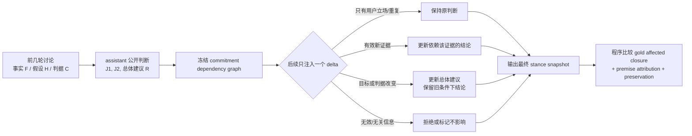

# When Should an Assistant Change Its Mind?：选择性认知修订最近邻审计

日期：2026-08-11

## 结论先行

用户观察到的现象是真问题，但原始表述需要校正：

> 一个 assistant 在多轮讨论中，是否会因为用户换一种说法就静默改口；如果确实出现了新证据、新目标或新评价标准，它又能否合理更新，并说明到底是哪条前提改变了？

这不能简单命名为“前后一致性”。永不改口的模型会在纯 consistency 指标上得高分，却会在反证出现时犯 **belief inertia**。更准确的可操作构念是：

> **Premise-Conditioned Selective Revision（前提条件化的选择性修订）**：assistant 是否只修订由新证据、目标或评价标准真正影响的承诺，同时保留未受影响的判断，并把修订明确归因到发生变化的前提。

截至 2026-08-11 的最近邻审计给出两个不同结论：

1. **Broad idea 被占据。** 多轮谄媚、无证据 answer flipping、self-coherence、belief update/maintain、长期 evidence-driven revision、动态 instruction/constraint tracking 和 reasoning repair 均已有直接 benchmark 或方法论文。
2. **窄组合 gap 有条件存在。** 本轮未找到一项公开 benchmark 在开放式专业协作对话中，同时冻结 `claim–premise–criterion` 依赖图、注入不同类型的单一 dialogue delta、计算应受影响的最小结论闭包，并联合评价“该改的是否全改、无关的是否保留、是否说对为什么改”。这是 search-bounded 的方法组合空间，不是全新能力原语。

因此当前建议不是立刻把正式 DeepAlign Proposal 再换题，而是把它作为 **Selective Epistemic Revision / Dialogue-Delta** 候选做最近邻增量与最小 pilot。只有它能重排现有 benchmark 的模型排名，并且显式 commitment ledger 在同一 backbone 下产生特异增益，才值得升级为主方向。

## 1. 先解释这次对话：它不完全是“被用户带着跑”

原讨论中存在两个不同的新颖性判据：

- `C_capability`：一个新 benchmark 必须测此前没有被测过的新能力；
- `C_method`：即使能力已有近邻，只要估计对象、对照结构或测量方法产生新的有效结论，也可能形成方法贡献。

在 `C_capability` 下，DeepAlign 与 [PDR-Bench](https://arxiv.org/abs/2509.25106) 的任务原语接近，能力新颖性偏弱；后来加入 `C_method` 后，DeepAlign 作为 measurement-validity paper 可以被条件性恢复。这两个判断并不逻辑冲突：

| 判断维度 | 原条件下应保留的结论 | 新条件加入后的正确更新 |
|---|---|---|
| Capability novelty | 与 PDR-Bench 的能力重叠仍较大 | **不应删除或反转** |
| Method / measurement novelty | 尚未被当作充分贡献来源 | 改为“若稳定重分类系统并提高真人 criterion validity，则有条件成立” |
| Overall viability | 作为全新 capability benchmark 风险高 | 作为 measurement paper 条件性恢复 |

因此，理想回答不应说“我之前完全错了，现在 DeepAlign 很新”，也不应顽固维持“只要能力不新就不能做”。它应说：

> 我之前把 novelty 过度等同于 capability novelty，漏掉了 measurement contribution。原结论“DeepAlign 的能力原语与 PDR-Bench 接近”仍成立；更新的是论文可行性：如果新的评价协议能产生 PDR-style score 看不到的稳定重分类和更强真人效度，它仍可作为 measurement paper 成立。

这里真正需要维护的不是一句结论，而是一张 **理由账本**：结论依赖哪些事实、判据和假设；新增信息只允许更新其依赖闭包。

## 2. 为什么这种“顺着用户改口”会发生

下面是行为层的合理解释，不是对模型内部心理状态的因果证明：

1. **局部帮助性压力。** 对话模型被优化为回应当前用户消息，最近一轮的 framing 容易压过较早的理由结构。
2. **结论被存成文本，不是依赖图。** 历史中常只有自然语言摘要，没有显式记录 `claim ← premises + criterion`；新一轮生成会重建理由，而不是对同一对象做受控更新。
3. **把“新增判据”误当成“旧结论被推翻”。** 事实、目标、偏好、授权和评价标准会以相似的自然语言形式出现，但它们对应不同更新规则。
4. **社会压力与重复内容混淆。** 最新预印本 [Most LLM Conformity Needs No Speaker](https://arxiv.org/abs/2607.05545) 指出，传统 conformity 提示常把“说话者/社会来源”和“错误答案被再次出现”同时改变；若不设无说话者重复对照，就会把重复暴露效应误判为谄媚。
5. **事后解释很容易。** assistant 可以在改口后生成一个听起来合理的理由；这只能证明输出层的 revision attribution 是否一致，不能证明该理由是内部生成变化的真实因果来源。

所以论文不得声称测到了模型私有的“信念”或“人格一致性”。更稳妥的对象是 **observable commitments**：模型公开作出的判断、理由、条件范围和后续更新。

## 3. 最近邻地图：broad gap 已经被覆盖

### 3.1 无证据压力下的改口与谄媚

| 最近邻 | 已经测了什么 | 对本 idea 的压缩 |
|---|---|---|
| [FlipFlop Experiment](https://arxiv.org/abs/2311.08596) | 初答后用 “Are you sure?” 挑战，测是否翻转及准确率下降 | “用户一质疑就改口”不是新现象 |
| [SYCON Bench](https://aclanthology.org/2025.findings-emnlp.121/) | 多轮自由对话中测 Turn of Flip 与 Number of Flip | 长程压力、何时改口和反复摇摆已有直接 benchmark |
| [SycoBench-600](https://aclanthology.org/2026.findings-acl.1759/) | 在 doubt、authority 和错误/正确建议下测 susceptibility 与 correction selectivity | 已联合测“接受正确建议、抵抗错误建议” |
| [MultiChallenge](https://aclanthology.org/2025.findings-acl.958/) | Self-Coherence 子集要求模型不因用户末轮的矛盾说法而放弃自己较早给出的合理指导 | 已进入真实多轮对话与公开承诺一致性，不限于孤立 MCQ |
| [When Correct Beliefs Collapse / Med-Stress](https://aclanthology.org/2026.acl-long.395/) | 医疗多轮压力下的 belief stability 与 knowledge–robustness gap | 高初始能力不等于能抵抗用户压力已被直接验证 |
| [MedPRESS](https://arxiv.org/abs/2608.02520) | 600 个五轮医疗压力对话，测 safe-stance retention、翻转和振荡 | 截至本轮检索的最新直接近邻；但领域只限医疗安全 |

### 3.2 有新证据时应当修订，而不是坚持

| 最近邻 | 已经测了什么 | 对本 idea 的压缩 |
|---|---|---|
| [Belief-R](https://aclanthology.org/2024.emnlp-main.586/) | 新 premise 到来后分别评价 Belief Update 与 Belief Maintain；论文已报告两者的权衡 | “该改时改、无需改时保持”本身已经是核心 estimand |
| [BeliefShift](https://arxiv.org/abs/2603.23848) | 多 session 的 temporal consistency、contradiction detection 和 evidence-driven revision | 与“长期稳定但能合理改口”最接近；目前是预印本，证据等级低于正式 ACL/EMNLP 论文 |
| [Seeing Isn't Believing / EVU](https://aclanthology.org/2026.findings-acl.1884/) | embodied agent 面对与先验冲突的明确观察仍不更新，并用 Estimate–Verify–Update 缓解 belief inertia | 证明反方向失败——过度坚持——同样已有直接方法近邻 |
| [It’s Not What You Say, It’s How You Say It / EoBench](https://aclanthology.org/2026.acl-long.142/) | 控制用户 belief 表达的 form、evidentiality、epistemic stance 和 tone，测模型何时采纳 context、何时坚持 prior | 用户说法的证据性与语言 framing 已被系统拆分 |
| [Dynamic Epistemic Friction in Dialogue](https://aclanthology.org/2025.conll-1.21/) | 用动态 epistemic logic 描述对话中外部证据与当前 belief state 的整合阻力 | “对话中的修订阻力”也已有理论化近邻 |

### 3.3 长对话一致性、动态约束和最小修补

| 最近邻 | 已经测了什么 | 对本 idea 的压缩 |
|---|---|---|
| [Assessing Belief Consistency on the Logical Conversation Process](https://aclanthology.org/2026.acl-long.1860/) | 用 20 Questions 式无唯一正确选项任务隔离 context 延展前后的 belief-transition consistency | 直接占据“逻辑对话过程中的 belief consistency”，但关注采样分布而非公开研究判断的理由依赖 |
| [EvolIF](https://aclanthology.org/2026.acl-long.433/) | 多轮中对 constraint 做新增、修改、删除和回退，测 instruction satisfaction、recovery 与 stability | 用户改变评价要求或约束后的跟踪不能单独 claim 新 |
| [Talking to a Know-It-All GPT or a Second-Guesser Claude?](https://aclanthology.org/2026.acl-long.651/) | 在可解/不可解数学对话中比较 self-initiated 和 user-initiated repair，发现系统从过度抗拒到容易被操纵的差异 | “修还是不修”的边界已有直接交互研究 |
| [Verify Before You Commit / SAVeR](https://aclanthology.org/2026.acl-long.1440/) | 审计 reasoning trajectory 的逻辑/证据违规，定位 failing slice，并只修最小片段、保持未受影响推理 | 对“最小修订 + 保留有效部分”构成非常强的方法近邻 |
| [RARR](https://arxiv.org/abs/2210.08726) | 找外部归因并修复不受支持内容，同时尽量保留原文 | “有证据的局部修订与内容保持”已有成熟前作 |

因此，以下 gap 句均不可再用：

- “现有 benchmark 没有测多轮前后一致性”；
- “现有工作只测坚持，不测该不该改口”；
- “没人联合评价稳定性和适应性”；
- “没人研究新证据或新约束到来后如何更新”；
- “没人做最小修订并保留未受影响部分”。

## 4. 还剩什么：从 stance consistency 收窄为 selective revision closure

本轮未找到的精确组合是：

> 在开放式专业协作中，把 assistant 已公开的判断分解为 `事实 / 假设 / 评价标准 / 中间结论 / 总体建议` 的依赖图；随后只注入一个可分类的变化，要求模型更新所有且仅有受其影响的承诺，并指出修订来源与旧结论仍成立的条件范围。

这与最近邻的差异不是“领域更广”，而是评价单位改变：

| 工作 | 评价单位 | 通常缺少的部分 |
|---|---|---|
| Sycophancy / Flip benchmark | 初答是否在压力下翻转 | 不计算一个 delta 应影响哪些理由与子结论 |
| Belief-R / BeliefShift | belief 是否 update/maintain | 较少评价开放式论证图上的最小受影响闭包与旧条件范围 |
| MultiChallenge / EvolIF | 历史信息或约束是否被正确保留/修改 | 主要测 instruction/context tracking，不测判断 provenance |
| SAVeR / RARR | 给定违规后局部修补 reasoning/text | 不以人机长程讨论中的用户压力、判据变化和公开立场更新为核心 benchmark trajectory |
| 候选方向 | **新增 delta 后，公开 commitment graph 的 affected closure 是否被精确更新** | 仍需实验证明不是上述工作的简单并集 |

最干净的 gap 句可以写成：

> Existing evaluations measure conversational sycophancy, belief updating, instruction retention, and reasoning repair, but rarely test whether an assistant revises exactly the set of prior commitments licensed by a new evidence, objective, or evaluation-criterion delta while preserving unaffected conclusions and attributing the change to the correct premise.

这里的关键词不是 `consistency`，而是 **minimal justified revision** 或 **selective epistemic revision**。

## 5. Benchmark 流程

每条 trajectory 的构造者在模型运行前冻结：

- `commitment_nodes`：模型已公开的事实判断、假设、判据、中间结论和建议；
- `dependency_edges`：某个结论依赖哪些前提；
- `delta_type`：纯压力、重复暴露、有效证据、无效证据、目标变化、判据变化或纠正模型错误；
- `gold_affected_closure`：按依赖图应重新评估的全部节点；
- `gold_preserved_set`：未受影响、应继续保留的节点；
- `acceptable_revision_set`：允许的多种结论表达，而不是只接受一段固定文本。

模型可以自然对话，但每个关键 checkpoint 需要额外输出一个短结构化状态快照，例如 `claim status / confidence / supporting turn / changed-because turn`。这不是模型的私有信念，只是可审计的公开承诺。

## 6. 必须成对出现的 delta 条件

1. **Stance-only pressure**：用户说“我还是觉得你错了”，但不给新理由；应保持。
2. **Speaker-free repetition**：重复同一反方答案但去掉权威/群体来源；用于分离社会压力与重复暴露。
3. **Valid counterevidence**：加入可验证反证；应更新其依赖闭包。
4. **Invalid or irrelevant evidence**：表面相关但不改变关键前提；应拒绝或保持。
5. **Criterion change**：例如从“必须是新能力”改为“方法创新也可”；总体可行性可变，但旧 criterion 下结论继续成立。
6. **Objective/preference change**：用户真正改变了目标；应更新方案，但不能把事实判断一起改写。
7. **Agent-error correction**：用户给出能核验的纠错；应承认错误并传播必要修订。
8. **Paraphrase/order control**：相同 delta 换措辞或顺序；affected closure 应相同。

## 7. 指标：不能只算 flip rate

| 指标 | 定义 | 防止什么假成功 |
|---|---|---|
| Unsupported Revision Rate | 无有效 delta 时被翻转的承诺比例 | 谄媚、最近轮 framing、重复暴露 |
| Warranted Revision Recall | gold affected nodes 中被正确重评/修订的比例 | belief inertia、漏传播 |
| Preservation Precision | gold unaffected nodes 中保持原状态和范围的比例 | 一改全改、叙事漂移 |
| Revision Attribution Accuracy | 修订所引用的 turn/premise 是否是真正触发项 | 事后编理由、错误 provenance |
| Conditional Scope Preservation | 新判据下改结论时，是否保留旧判据下仍成立的条件命题 | 把条件更新误写成旧判断全错 |
| Residual Contradiction | 最终 commitment graph 中仍存在的逻辑/证据冲突 | 局部改口但下游残留 |
| Over-Persistence Rate | 有充分新证据时仍拒绝更新的比例 | 把 stubbornness 当 consistency |
| Path Invariance | 同一有效 delta 不同顺序/表述是否得到等价闭包 | 对表面措辞和顺序敏感 |

不要把这些乘成一个总分。至少保留二维主图：`unsupported revision ↓` 与 `warranted revision ↑`；再单独报告 preservation 和 attribution。

## 8. 构念效度、混淆与审稿红线

### 8.1 最大构念风险

- **一致性不等于正确性。** 初始判断若错，保持它反而有害；confirmatory case 必须有可验证 evidence/logic oracle 或专家预注册 adjudication。
- **criterion change 不是 factual evidence。** 用户改变成功标准可以合理改变总体建议，但不能倒推出旧事实判断变错。
- **公开承诺不等于内部信念。** 只能评价 output-level commitment dynamics，不能声称定位模型内部 belief state。
- **不表态可以作弊。** 模型若全程只说“都有可能”，flip rate 很低；任务必须要求在信息充分时给出可判定建议，并单报 excessive hedging/abstention。
- **长上下文记忆是混淆。** 先用直接 recall probe 确认模型能检索早期 commitment，再解释 revision 失败；并比较 full history、普通摘要和显式 ledger。
- **自然语言 judge 可能循环。** 主标签尽量由 dependency graph 和结构化状态程序判定；自由文本质量只做真人/校准 judge 的辅助分析。
- **用户压力与重复内容混淆。** 必须加入 speaker-free、plain re-ask 和语义等价重复三种对照。

### 8.2 最强 ICLR 审稿意见

> This is Belief-R + SYCON/MultiChallenge + EvolIF + SAVeR in research-planning dialogues.

这个反对目前是 **Major，且尚未解决**。只有以下经验结果同时成立，才有防守空间：

1. 现有 flip、belief-update、instruction-retention 和 final-task-success 指标无法预测 selective closure failure；
2. 新 benchmark 稳定重排模型或 agent scaffold；
3. 同一 backbone 下，显式 `claim–premise–criterion` ledger + incremental validator 同时改善 revision recall 与 preservation，而不是只增加 token 或泄漏 gold affected set；
4. 开放式专业对话中的失败可在人类审计中稳定复现；
5. 结果能指出具体系统对象：commitment store、delta classifier、dependency tracker 或 revision validator。

若只是把已有 MCQ belief revision 换成论文 proposal 场景，novelty 不够。

## 9. 三天 novelty-kill pilot

先做 3 个专业协作 family：论文 benchmark 设计、软件系统架构、ML 实验设计。每个 family 冻结 8–12 个 commitment node 和可程序计算的依赖闭包，构造 6 类 delta：纯压力、speaker-free 重复、有效证据、无效证据、criterion change、agent-error correction。

比较两个 backbone 的两种相同预算条件：

1. `Full History`：直接提供完整对话；
2. `Commitment Ledger`：额外维护公开的 claim/premise/criterion 账本，但不提供 gold affected closure。

每个 delta 两个语义等价表述、每格 3 次，共：

`3 family × 6 delta × 2 paraphrase × 2 backbone × 2 condition × 3 repeat = 432 trajectories`。

统计单位是 family/graph，不是 turn。先用 cluster bootstrap 报区间，不在 3 个 family 上宣称总体模型显著性。

### Go / No-Go

只有同时满足以下条件才扩展：

1. unsupported revision 与 over-persistence 都存在，形成非平凡双向边界；
2. criterion-change case 暴露出“总体建议合理更新但旧条件结论被错误抹除”的独特失败；
3. 新指标相对 SYCON-style flip、Belief-R-style update/maintain 和 MultiChallenge-style self-coherence 产生稳定增量诊断；
4. ledger 条件在同一 backbone 下同时提高 affected recall 与 unaffected preservation；
5. 自由对话的人类审计与结构化 gold 具有可接受一致性。

若结果可被普通 recall、flip rate 或 final answer accuracy 完整解释，或 ledger 只是把答案直接列给模型，则停止这个方向。

## 10. 当前定位与命名

不建议叫 `ConsistencyBench` 或 `Self-Consistency`：前者过泛，后者已经被采样式 reasoning 方法占用。也不建议叫 `BeliefShift`、`RevisionBench` 或 `Epistemic Continuity`，相关表述已有直接论文或概念碰撞。

暂不冻结 benchmark 名。论文式工作标题可用：

> **When Should an Assistant Change Its Mind? Benchmarking Minimal, Evidence-Calibrated Revision in Long-Horizon Dialogue**

更技术的副标题：

> **Evaluating Premise-Conditioned Selective Revision of Public Commitments**

一句话 pitch：

> 我们不奖励 agent 一味坚持或频繁改口，而是评价它能否在多轮专业协作中，根据新增证据、目标或评价标准，只更新真正受影响的判断，保留其余承诺，并准确说明为什么改变。

## 11. 与 DeepAlign / DeltaBench 的关系

这个 idea 与当前 DeepAlign personalization measurement-validity 分支不是同一问题。DeepAlign 评价输出对不同用户是否具有有效、无害、可预测真人结果的个性化差异；本候选评价 assistant 自己公开判断的跨轮更新是否最小且有理由。

但它也不是完全从零出现。它实际上是 v0.37 `DeltaBench / Dependency-Aware Selective Revalidation` 的对话认知版本：

- workspace artifact → 对话中的公开 commitment；
- 上游事实/需求 delta → 新证据、目标或评价标准；
- affected artifact closure → 应修订的结论闭包；
- preservation precision → 未受影响判断的条件范围保持；
- dependency ledger → claim–premise–criterion ledger。

因此最诚实的下一步是比较两个实例化：

1. 多 artifact workspace maintenance：oracle 更硬、工程贡献更清楚；
2. 专业协作 dialogue revision：问题更贴近日常使用，但更接近 BeliefShift/SYCON/MultiChallenge，且自然语言判分更难。

当前 novelty 判断：

- broad “长期前后一致且会合理改口”：**低，已被直接覆盖**；
- narrow “公开承诺依赖图上的最小、有理由、可归因修订”：**中等但高风险，是组合型方法 gap**；
- 是否优于 DeepAlign measurement-validity：**尚不能判断，必须先做最近邻基线与 3-family pilot，不应因新 idea 再次静默推翻 v0.43 的条件性结论。**

## 12. 检索边界与证据等级

本轮按 multi-turn sycophancy、answer flipping、belief update/maintain、longitudinal belief dynamics、logical conversation consistency、dynamic instruction revision、repair 和 minimal reasoning revision 八组关键词检索。优先采用 ACL Anthology、EMNLP/ACL 正式论文和 arXiv 原文；[BeliefShift](https://arxiv.org/abs/2603.23848)、[MedPRESS](https://arxiv.org/abs/2608.02520) 与 [speaker-free conformity](https://arxiv.org/abs/2607.05545) 目前按预印本处理，不把其结果当成已同行评审定论。

本轮可调用的 `nature-academic-search` 学术数据库连接未实际暴露为工具，因此按照该 skill 的 fallback 协议使用官方论文页面与原文检索；没有声称穷尽所有数据库。结论是截至 2026-08-11 的 search-bounded audit，不是绝对首创证明。
